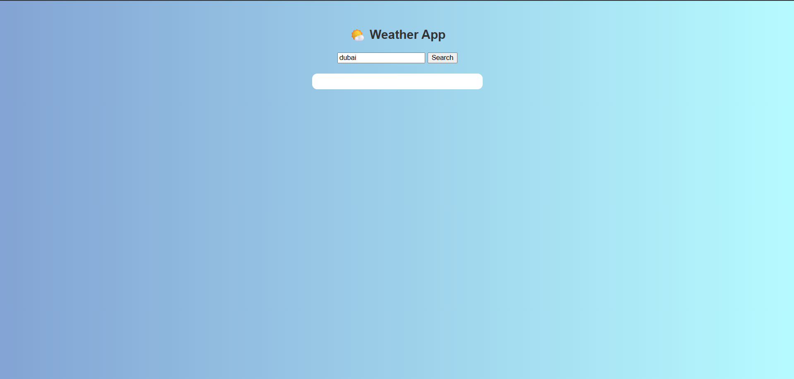
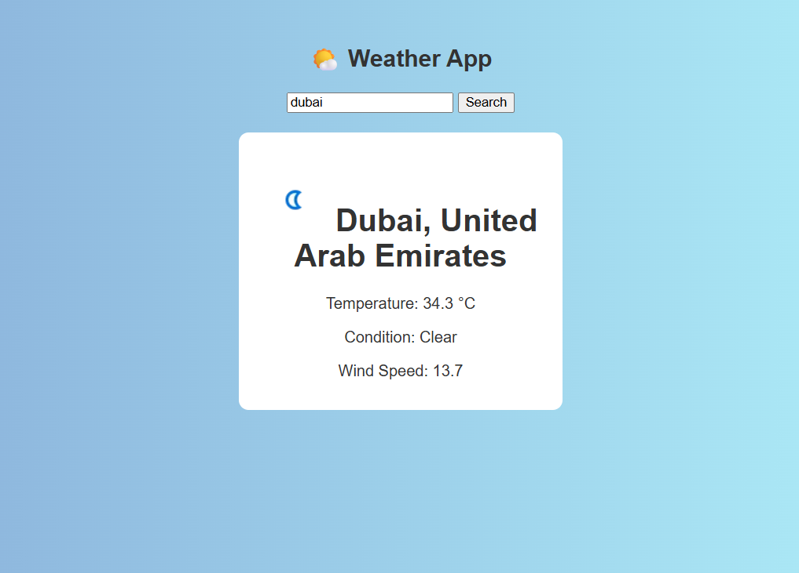

# 🌦️ Weather Search App

A simple web application that fetches real-time weather data for any city using the [WeatherAPI](https://www.weatherapi.com/) and displays the current temperature, wind speed, and other weather details. The backend is built with Flask, and the frontend uses HTML, CSS, and JavaScript.

---

## 🚀 Features

- 🔍 Search by city name
- ☁️ Displays:
  - Temperature (°C)
  - Weather condition (text + icon)
  - Wind speed
  - City and country
- 📝 Saves data to a local `weather_data.json` file
- 🌐 Clean and interactive web interface

---

## 🛠️ Tech Stack

- **Frontend**: HTML, CSS, JavaScript
- **Backend**: Python, Flask
- **API**: [WeatherAPI](https://www.weatherapi.com/)
- **Extras**: dotenv for API key handling, flask-cors for local testing

---

## 📷 Demo




---

## 📁 Project Structure

```

weather-app/
├── app.py                  # Flask backend
├── index.html              # Frontend HTML page
├── weather_data.json       # Locally stored weather data
├── .env                    # Stores your Weather API key
├── requirements.txt        # Python dependencies
└── README.md               # This file

````

---

## 🧪 Getting Started

### 1. Clone the repository

```bash
git clone https://github.com/your-username/weather-app.git
cd weather-app
````

### 2. Install dependencies

```bash
pip install -r requirements.txt
```

### 3. Add your API key

Create a `.env` file in the root folder:

```
API_KEY=your_weatherapi_key_here
```

Get a free key from [WeatherAPI](https://www.weatherapi.com/).

### 4. Run the Flask backend

```bash
python app.py
```

The server will run at `http://127.0.0.1:5000`.

### 5. Open the frontend

Open `index.html` in your browser, or serve it using:

```bash
python -m http.server
```

Then visit: `http://localhost:8000/index.html`

---

## 📌 Example Usage

1. Enter the name of any city (e.g., `Paris`, `Dubai`)
2. Click **Search**
3. Instantly view:

   * 🌡 Temperature
   * 🌬 Wind speed
   * 🌥 Weather condition

---

## 📄 License

This project is open-source and available under the [MIT License](LICENSE).

---

## 🙋‍♀️ Author

Built with ❤️ by [RC](https://github.com/neverbeatenrc)
LinkedIn profile - [Aarsee](https://www.linkedin.com/in/aarsee-%E2%A0%80-4ba1b0307/)


